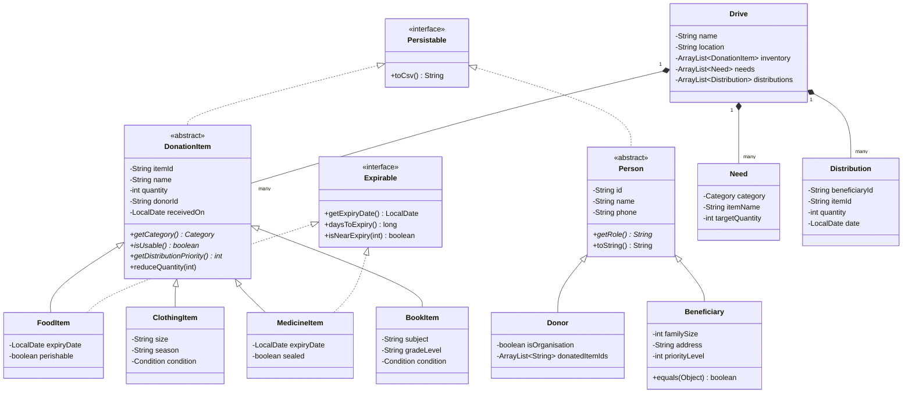

# Donation Drive Manager

A console-based Java application that helps colleges, NGOs, housing societies and community groups **run donation drives without chaos**: track what has been collected, what is still needed, what is about to expire, and who has received what.

---

## 1. The Problem

Donation drives (flood relief, winter clothes, ration kits, book drives) are usually tracked on paper or WhatsApp. This causes four recurring problems:

| Problem | What goes wrong |
|---|---|
| No live stock count | Organisers don't know what has already been collected |
| No targets | Too much of one item, nothing of another |
| Expiry blindness | Food and medicines expire in storage unnoticed |
| Unfair distribution | Some families receive items twice, others receive nothing |

## 2. The Solution

Donation Drive Manager gives a drive organiser one place to:

1. **Register donors and donations.** Every item is logged with its type, quantity and details.
2. **Set targets** ("we need 200 blankets") and see a live **"Still Needed"** list.
3. **Get expiry alerts** for food and medicines, and distribute the earliest-expiring stock first.
4. **Register beneficiaries** with duplicate detection, so the same family can't be registered twice.
5. **Distribute fairly.** The system blocks repeat handouts of the same category within a set window.
6. **Generate reports**, such as a drive summary and donor acknowledgements.
7. **Save and load everything** from files, so no data is lost between runs.

---

## 3. Tech Stack

| Layer | Choice | Why |
|---|---|---|
| Language | Java 17 | Course requirement; modern LTS |
| Interface | Console (`Scanner`) | Keeps the focus on OOP, not UI |
| Storage | CSV text files (`java.io`) | Covers file I/O from the syllabus; human-readable |
| Dates | `java.time.LocalDate` | Clean expiry calculations |
| Build | Plain `javac` / `java` | No frameworks; every line is mine |

---

## 4. Project Structure

```text
donation-drive-manager/
├── README.md
├── data/                         # created at runtime
│   ├── donors.csv
│   ├── beneficiaries.csv
│   ├── items.csv
│   ├── needs.csv
│   └── distributions.csv
└── src/
    ├── app/
    │   └── DonationDriveApp.java         # main(), console menu
    ├── model/
    │   ├── person/
    │   │   ├── Person.java               # abstract
    │   │   ├── Donor.java
    │   │   └── Beneficiary.java
    │   ├── item/
    │   │   ├── DonationItem.java         # abstract
    │   │   ├── FoodItem.java
    │   │   ├── ClothingItem.java
    │   │   ├── MedicineItem.java
    │   │   └── BookItem.java
    │   ├── Category.java                 # enum
    │   ├── Condition.java                # enum
    │   ├── Need.java
    │   ├── Distribution.java
    │   └── Drive.java
    ├── contract/
    │   ├── Expirable.java                # interface
    │   └── Persistable.java              # interface
    ├── service/
    │   ├── InventoryService.java
    │   ├── NeedsService.java
    │   ├── DistributionService.java
    │   └── ReportService.java
    ├── storage/
    │   └── FileManager.java
    ├── exception/
    │   ├── InsufficientStockException.java
    │   ├── DuplicateBeneficiaryException.java
    │   └── DistributionNotAllowedException.java
    └── util/
        ├── IdGenerator.java
        └── AppConstants.java
```

---

## 5. Architecture Overview

The app follows a simple **layered architecture**. Each layer only talks to the layer directly below it.

```text
┌────────────────────────────────────────────┐
│  app          DonationDriveApp (menu/UI)   │  reads input, prints output
├────────────────────────────────────────────┤
│  service      Inventory / Needs /          │  all business rules live here
│               Distribution / Report        │
├────────────────────────────────────────────┤
│  model        Person, DonationItem, Drive, │  data + behaviour of each object
│               Need, Distribution           │
├────────────────────────────────────────────┤
│  storage      FileManager                  │  reads/writes CSV files
└────────────────────────────────────────────┘
```

**Rule of thumb:** the menu never calculates anything, and the models never print to the console.

---

## 6. Class Diagram



*(GitHub renders this diagram automatically.)*

---

## 7. Class-by-Class Responsibilities

### 7.1 People (`model.person`)

| Class | Type | Responsibility |
|---|---|---|
| `Person` | abstract | Common fields (id, name, phone); abstract `getRole()` |
| `Donor` | extends `Person` | Individual or organisation; keeps a list of their donations |
| `Beneficiary` | extends `Person` | Family size, address, priority level; **overrides `equals()`** to detect duplicates |

```java
// Beneficiary.java: two registrations with the same phone are the same family
@Override
public boolean equals(Object o) {
    if (this == o) return true;                       // same object in memory
    if (!(o instanceof Beneficiary)) return false;    // different type
    Beneficiary other = (Beneficiary) o;
    return this.getPhone().equals(other.getPhone());  // compare by phone number
}
```

### 7.2 Items (`model.item`): the heart of the project

`DonationItem` is **abstract**. Each subclass answers three questions differently:

| Method | `FoodItem` | `ClothingItem` | `MedicineItem` | `BookItem` |
|---|---|---|---|---|
| `getCategory()` | FOOD | CLOTHING | MEDICINE | BOOK |
| `isUsable()` | not expired | condition ≠ DAMAGED | not expired **and** sealed | condition ≠ DAMAGED |
| `getDistributionPriority()` | days to expiry (sooner = first) | 100 (no rush) | days to expiry | 100 (no rush) |

```java
// DonationItem.java (abstract parent)
public abstract class DonationItem implements Persistable {
    private final String itemId;
    private String name;
    private int quantity;

    public abstract Category getCategory();
    public abstract boolean isUsable();
    public abstract int getDistributionPriority();   // lower = hand out first

    public void reduceQuantity(int amount) throws InsufficientStockException {
        if (amount > quantity) {
            throw new InsufficientStockException(name, quantity, amount);
        }
        quantity -= amount;
    }
}
```

```java
// FoodItem.java: inherits from DonationItem, also promises to be Expirable
public class FoodItem extends DonationItem implements Expirable {
    private LocalDate expiryDate;

    @Override
    public Category getCategory() { return Category.FOOD; }

    @Override
    public boolean isUsable() { return daysToExpiry() > 0; }   // uses interface method

    @Override
    public int getDistributionPriority() { return (int) daysToExpiry(); }

    @Override
    public LocalDate getExpiryDate() { return expiryDate; }
}
```

### 7.3 Interfaces (`contract`)

| Interface | Implemented by | Why an interface (not a parent class)? |
|---|---|---|
| `Expirable` | `FoodItem`, `MedicineItem` | Only *some* items expire. It's a capability, not an "is-a" relationship |
| `Persistable` | `DonationItem`, `Person` | Unrelated classes that all need `toCsv()` for saving |

```java
public interface Expirable {
    LocalDate getExpiryDate();

    default long daysToExpiry() {     // default method: shared logic
        return ChronoUnit.DAYS.between(LocalDate.now(), getExpiryDate());
    }

    default boolean isNearExpiry(int withinDays) {
        return daysToExpiry() <= withinDays;
    }
}
```

### 7.4 Drive, Need, Distribution (`model`)

| Class | Responsibility |
|---|---|
| `Drive` | One donation drive. **Composition:** a drive *has* inventory, needs and distributions |
| `Need` | A target, e.g. "BLANKET × 200" |
| `Distribution` | A record that beneficiary X received Y units of item Z on date D |

### 7.5 Services (`service`): business rules

| Service | Key methods | Rule it enforces |
|---|---|---|
| `InventoryService` | `addDonation(item)`, `addDonation(item, donor)` *(overloaded)*, `getUsableStock()`, `getExpiringSoon()` | Rejects unusable items at entry |
| `NeedsService` | `addNeed()`, `getStillNeeded()` | Remaining = target − collected |
| `DistributionService` | `registerBeneficiary()`, `distribute()` | No duplicates; no repeat category within 30 days; earliest-expiry first |
| `ReportService` | `driveSummary()`, `donorAcknowledgement()` | Builds text with `StringBuilder` |

```java
// DistributionService.java: polymorphism in action
// Works for ANY item type without knowing which subclass it is
public DonationItem pickNextItem(Category category) {
    DonationItem best = null;
    for (DonationItem item : drive.getInventory()) {
        if (item.getCategory() == category && item.isUsable()) {   // overridden methods
            if (best == null ||
                item.getDistributionPriority() < best.getDistributionPriority()) {
                best = item;
            }
        }
    }
    return best;
}
```

### 7.6 Storage (`storage.FileManager`)

- `saveAll(Drive drive)`: writes each list to its CSV using `toCsv()`.
- `loadAll()`: reads the CSVs back, using the `type` column to decide which subclass to create.

```text
# items.csv
type,itemId,name,quantity,donorId,receivedOn,extra1,extra2
FOOD,I001,Rice 5kg,40,D001,2026-10-01,2026-12-31,false
CLOTHING,I002,Blanket,25,D002,2026-10-02,FREE,WINTER
MEDICINE,I003,ORS Sachet,100,D001,2026-10-03,2027-06-30,true
```

### 7.7 Custom Exceptions (`exception`)

| Exception | Thrown when |
|---|---|
| `InsufficientStockException` | Trying to give out more than is in stock |
| `DuplicateBeneficiaryException` | Registering a family that already exists (`equals()` match) |
| `DistributionNotAllowedException` | Same family, same category, within the repeat window |

### 7.8 Utilities (`util`)

```java
public final class AppConstants {              // final: cannot be extended
    public static final int NEAR_EXPIRY_DAYS = 7;
    public static final int REPEAT_WINDOW_DAYS = 30;
    public static final String DATA_DIR = "data/";
    private AppConstants() {}                  // no objects allowed
}

public class IdGenerator {
    private static int itemCounter = 0;        // static: shared by the whole program
    public static String nextItemId() {
        itemCounter++;
        return String.format("I%03d", itemCounter);   // I001, I002 ...
    }
}
```

---

## 8. OOP Concept Map

Where every syllabus concept appears, ready for the viva:

| Concept | Where it's used |
|---|---|
| Class & Object | Every model class; objects created from menu input |
| Encapsulation | All fields `private`, accessed through getters/setters with validation |
| Constructors (incl. overloaded) | `FoodItem(name, qty, expiry)` and `FoodItem(name, qty, expiry, perishable)` |
| `this` / `super` | Subclass constructors call `super(...)` to set parent fields |
| Inheritance | `Person → Donor/Beneficiary`, `DonationItem → 4 item types` |
| Abstract class | `Person`, `DonationItem` |
| Interface (+ default methods) | `Expirable`, `Persistable` |
| Method overriding (runtime polymorphism) | `isUsable()`, `getCategory()`, `getDistributionPriority()`, `toString()` |
| Method overloading | `addDonation(item)` / `addDonation(item, donor)` |
| `static` | `IdGenerator` counters, constants |
| `final` | `AppConstants` class, `itemId` field |
| `equals()` / `toString()` | Duplicate beneficiary check; readable printing of every object |
| `ArrayList` | Inventory, needs, distributions, donors, beneficiaries |
| `StringBuilder` | `ReportService` report generation |
| Enums | `Category`, `Condition` |
| File I/O | `FileManager` reads/writes CSV |
| Exception handling (custom) | Three custom exceptions with `try/catch` in the menu |
| Composition | `Drive` *has* lists of items, needs, distributions |

---

## 9. Main Menu Flow

```text
===== DONATION DRIVE MANAGER =====
 1. Register donor
 2. Log a donation
 3. Set a need / target
 4. View inventory
 5. View "Still Needed" list
 6. View items expiring soon
 7. Register beneficiary
 8. Distribute items
 9. Reports
10. Save & exit
==================================
```

### Sample run

```text
> 6
--- Expiring within 7 days ---
[FOOD]     I007  Bread packets   x30   expires in 2 days  ⚠
[MEDICINE] I011  Paracetamol     x50   expires in 6 days

> 5
--- Still Needed ---
BLANKET        collected 120 / 200   → need 80 more
RICE (kg)      collected 450 / 400   ✔ target met
NOTEBOOK       collected  60 / 300   → need 240 more

> 8
Beneficiary ID: B014
Category: CLOTHING
✘ Not allowed: B014 already received CLOTHING on 2026-10-02 (within 30 days)
```

---

## 10. How to Run

**Requirements:** JDK 17 or newer.

```bash
# from the project root
mkdir -p out
javac -d out $(find src -name "*.java")
java -cp out app.DonationDriveApp
```

On Windows (PowerShell):

```powershell
mkdir out
javac -d out (Get-ChildItem -Recurse -Filter *.java src).FullName
java -cp out app.DonationDriveApp
```

---

## 11. Build Plan

| Step | Build | Concepts practised |
|---|---|---|
| 1 | `Category`, `Condition` enums + `AppConstants`, `IdGenerator` | enums, static, final |
| 2 | `Person`, `Donor`, `Beneficiary` | abstract class, inheritance, `equals()` |
| 3 | `DonationItem` + `ClothingItem`, `BookItem` | abstract methods, overriding |
| 4 | `Expirable` + `FoodItem`, `MedicineItem` | interfaces, default methods |
| 5 | `Drive`, `Need`, `Distribution` | composition, `ArrayList` |
| 6 | `InventoryService`, `NeedsService` | overloading, polymorphic loops |
| 7 | Custom exceptions + `DistributionService` | exception handling |
| 8 | `ReportService` | `StringBuilder` |
| 9 | `FileManager` | file I/O |
| 10 | `DonationDriveApp` menu | putting it all together |

Each step compiles and can be tested on its own before moving on.

---

## 12. Future Scope

- Multiple drives running at once, with a drive selector
- Volunteer accounts with role-based actions (`Volunteer extends Person`)
- Export reports to PDF
- GUI version (JavaFX / Swing)
- Web version with a database, so many volunteers can update stock at once
- SMS/WhatsApp alerts to donors when their donation reaches a family

---

## 13. Note on Medicines

In real drives, only **sealed, unexpired, over-the-counter** medicines should be accepted, and distribution should follow local rules and involve a qualified person. The app enforces "sealed + unexpired" in `MedicineItem.isUsable()`, but it is a tracking tool, not medical advice.

---

## Author

**Soumya Narang**  
B.Tech CSE, Manipal University Jaipur  
Object Oriented Programming using Java: Mini Project
